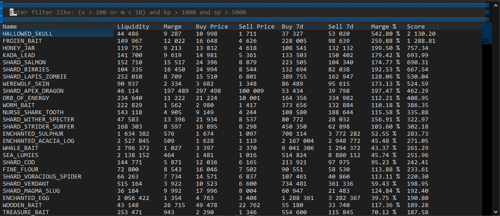

<div id="top">
<div align="center">


# HYPIXEL-BAZAAR-FLIPPER

<em>Unlock Profit Potential, Automate Your Way</em>

<em>Built with the tools and technologies:</em>


</div>
</div>

---

A terminal-based analysis tool for identifying high-margin item flips on the Hypixel SkyBlock Bazaar.

This project **does not automate** any buying or selling. Instead, it ranks Bazaar items based on calculated profit margins, liquidity, and an overall profitability score. It provides an interactive terminal UI to sort and filter item opportunities, leaving all actions to the user.

> Using this tool consistently has allowed me to manually generate over **1 billion coins** in-game through optimized flipping strategies.

<div align="center"> 
    
</div>

---

## Features

- Fetches real-time data from the Hypixel API (or optionally from a local cache)
- Calculates and ranks items by:
  - Raw margin
  - Margin percentage
  - Liquidity
  - A composite score
- Interactive terminal UI with real-time filtering
- Flexible filter expressions using logical operators
- Offline mode using previously saved data
- Logging system for daily activity

---

## Example Use Case

This tool helped generate over **1 billion coins manually** by consistently identifying high-volume, high-margin flip opportunities.

---

## Project Structure

```

hypixel-bazaar-flipper/
├── api.py             # Data fetching, processing, scoring
├── console.py         # Terminal interface (Textual)
├── main.py            # Entry point
├── data/bazaar.json   # Local cache of Bazaar data
├── logs/              # Execution logs by date
├── .env               # Your Hypixel API key
├── pyproject.toml     # Dependencies and setup

````

---

## Installation

### Prerequisites

- Python 3.11+
- [uv](https://github.com/astral-sh/uv) (recommended dependency manager)

### Setup

1. Clone the repository:

```bash
git clone https://github.com/julesgtz/hypixel-bazaar-flipper.git
cd hypixel-bazaar-flipper
````

2. Install dependencies:

```bash
uv sync
```

3. Create a `.env` file and insert your Hypixel API key:

```
API_KEY=your_api_key_here
```

To obtain an API key:

* Log-on `https://developer.hypixel.net/dashboard/`
* Copy the generated key

---

## Usage

Run the app:

```bash
uv run main.py
```

### Options

* Run in offline mode (load local cache instead of contacting the API):

```bash
uv run main.py --offline
```

* Enable debug logging:

```bash
uv run main.py --debug
```

---

## Filtering System

The terminal UI includes a dynamic filter input. You can use logical expressions to filter the list of items.
<div align="center"> 
  
</div>


### Available Abbreviations

| Abbreviation | Full name      |
|--------------|----------------|
| `s`          | score          |
| `bp`         | buy price      |
| `sp`         | sell price     |
| `m`          | margin         |
| `mp`         | margin percent |
| `l`          | liquidity      |
| `p`          | profit         |

> You can also use full attribute names instead of abbreviations. For example, both `s > 5000` and `score > 5000` will work. This applies to:
>
> * `score`
> * `buy_price`
> * `sell_price`
> * `margin`
> * `margin_pct`
> * `liquidity`
> * `profit`

---

### Operators Supported

* Comparison: `>`, `<`, `>=`, `<=`, `==`, `!=`
* Logical: `and`, `or`, `not`
* Parentheses for grouping: `(` and `)`

---

### Examples

```text
s > 10000 and mp > 5
(bp < 1000 or m > 2000) and liquidity > 30000
(score > 1000 and buy_price < 5000) or margin_pct > 8
```

This gives you full flexibility: write quick filters using abbreviations, or use explicit field names for clarity.

---

## How It Works

1. The app fetches Bazaar data (or loads from cache)
2. It filters out profitable items
3. It computes:
   * Margin (buy - sell)
   * Margin percent
   * Liquidity (sqrt of buy/sell weekly volume)
   * A profitability score
4. The terminal UI displays a sortable, filterable table
5. You choose what to buy/sell manually based on this data

---

## Logs

Each run produces a log file in `logs/` with the current date. You can enable debug-level output using `--debug`.

---

## Roadmap

* [x] Interactive terminal UI
* [x] Filter expressions
* [x] Scoring system
* [ ] CSV export
* [ ] Discord webhook alerts
* [ ] Web interface

---

## License

This project is licensed under the MIT License. See the [LICENSE](./LICENSE) file for details.

---

## Disclaimer

This is a utility for manual Bazaar analysis only. It does not automate gameplay or violate Hypixel rules. Use responsibly.

